<p align="center">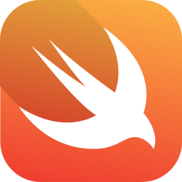</p>

# Atlas: private, on-device résumé screening for campus hiring

## What it does
Atlas helps a recruiter screen hundreds of student applications without sending anyone's résumé to an online AI service. You give it the student list exported from Google Forms (Excel or CSV) and describe, in plain words, who you're looking for. Atlas downloads each student's résumé from the link in the list, reads it, and has an AI model running **on your own computer** (through Ollama) score it against your criteria. Students land in three groups, **Shortlisted, Cutoff and Rejected**, and you can move the score lines and watch the groups change instantly, without re-scoring anyone. Every score comes with the reasons and the quotes from the résumé that back it up, and you can move anyone by hand with a note. A long screening can run overnight: if the Wi-Fi drops, Ollama stops or the laptop restarts, Atlas pauses and carries on exactly where it stopped. When you're done, it exports a clean CSV that opens safely in Excel.

## Screenshots
All screenshots use fictional students.

| | Light | Dark |
|---|---|---|
| Start-up |  |  |
| Welcome | 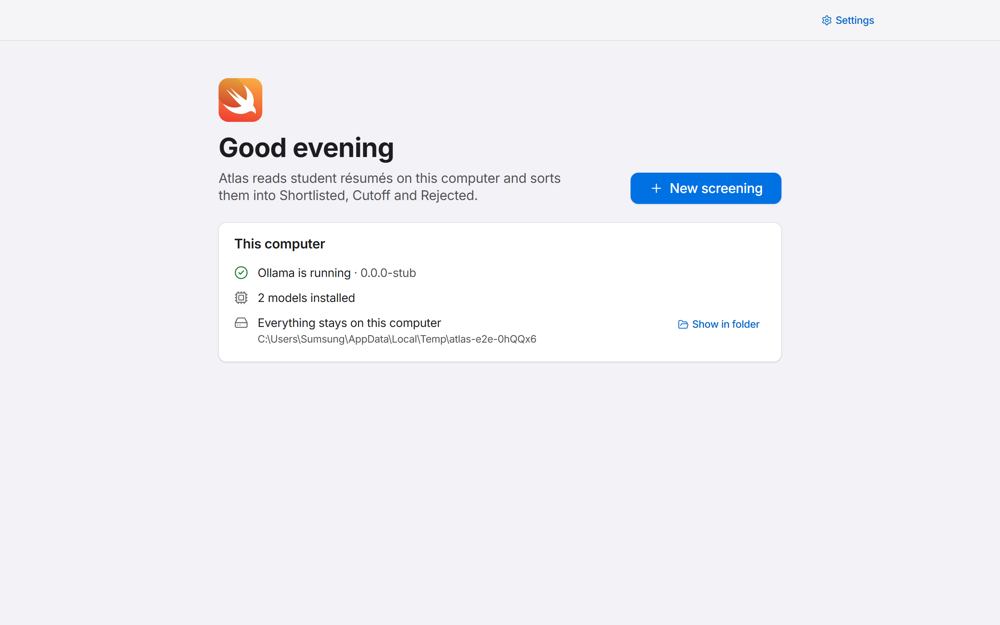 | 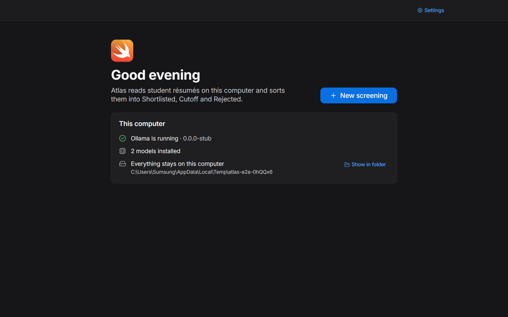 |
| Cutoffs | 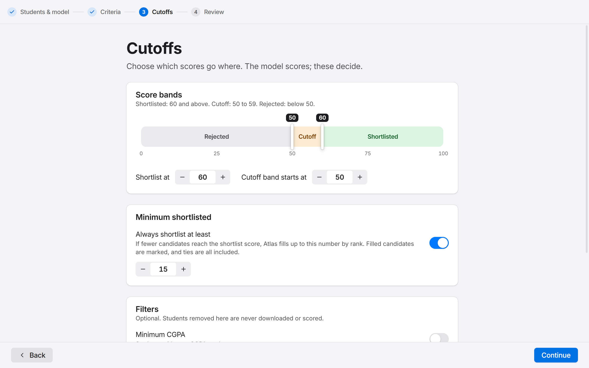 | 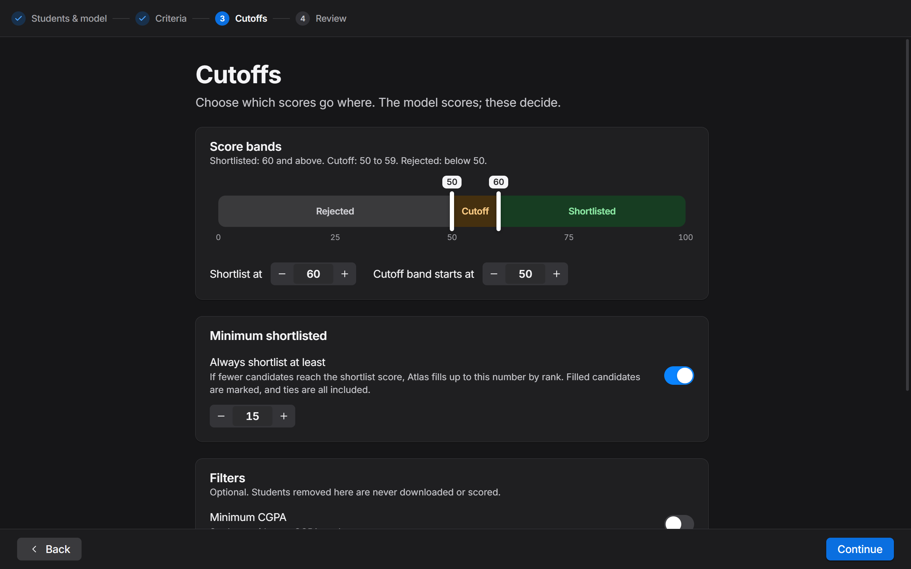 |
| Progress | 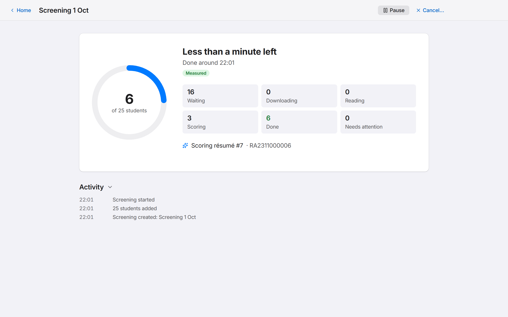 | 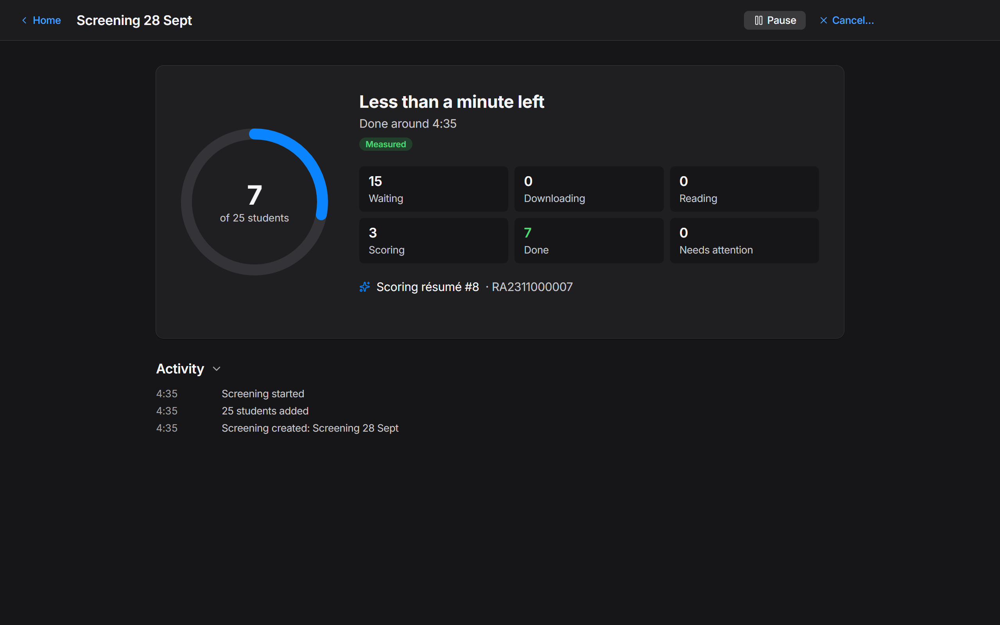 |
| Results | 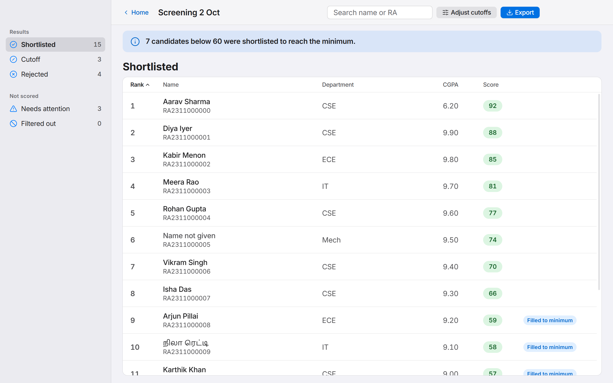 | 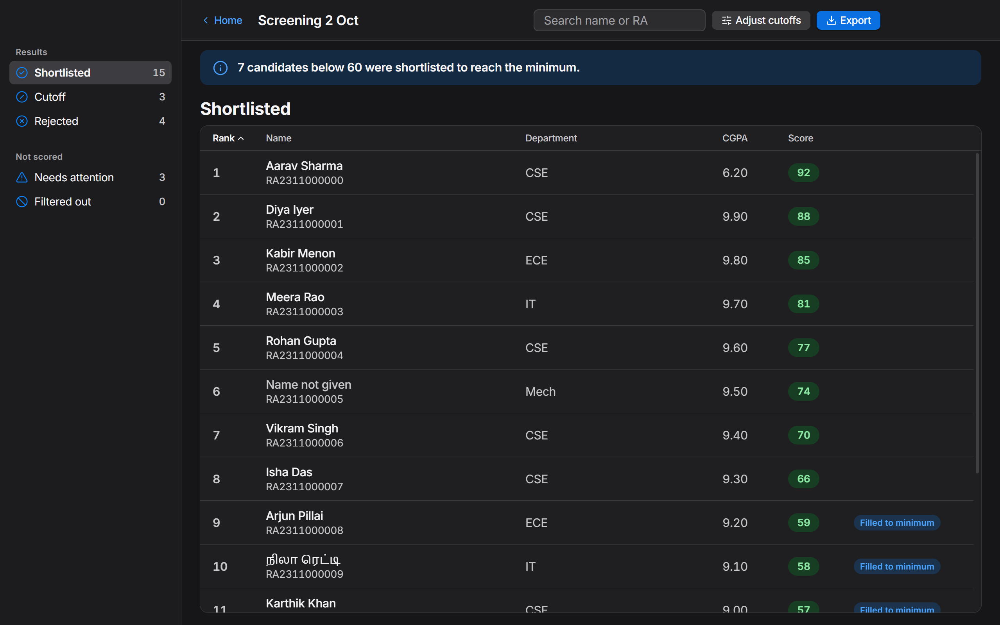 |
| Candidate detail | 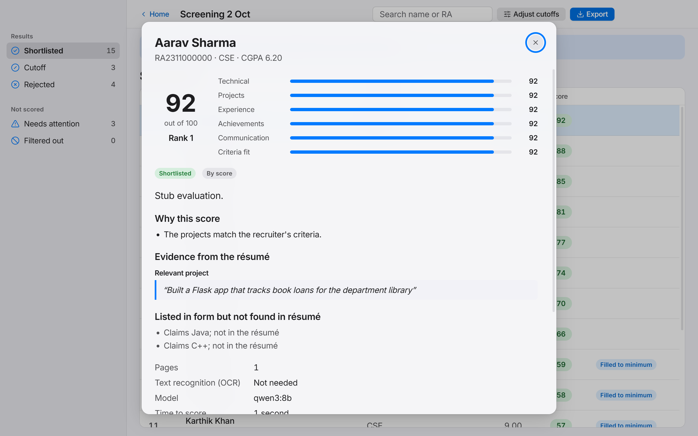 | 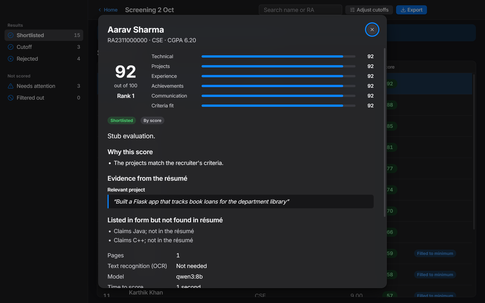 |

More, for every screen and both themes: [`docs/summaries/phase2/screens/`](docs/summaries/phase2/screens/), [`docs/summaries/phase3/screens/`](docs/summaries/phase3/screens/) and [`docs/summaries/branding/screens/`](docs/summaries/branding/screens/).

## Key features
- **CSV or Excel in, with a pre-flight report.** Atlas reads the Google Forms export (`.csv` or `.xlsx`), recognises its columns, and lists every problem before anything is saved: missing or duplicate RA numbers, missing links, links shared by several students.
- **A local AI model, through Ollama.** The model (for example `qwen3:8b`) runs on the recruiter's computer. Atlas tests a model once before using it, and can find and start an installed Ollama for you.
- **Identity redaction.** Name, email, phone, RA number, section and photos never reach the model, including the copies inside the résumé itself (its header, email addresses, profile handles).
- **Live cutoffs, minimum fill and ties.** Move the shortlist and cutoff lines and see the groups change at once. Ask for "at least N shortlisted" and Atlas fills by rank, labels who was filled, and never splits a tie.
- **Overrides.** Move one student or several to another group, with a note; every move is recorded and always wins.
- **Crash-safe resume.** All progress lives in a SQLite database. Kill Atlas at any instant and it resumes exactly where it stopped: no student lost, none screened twice.
- **Pause on network or Ollama loss.** "No internet connection", "Connected to Wi-Fi that needs a sign-in page" and "Ollama isn't running" pause the run, and it continues by itself when the problem is gone; nobody is failed because of the computer.
- **Excel-safe export.** UTF-8 with a byte-order mark, so Indian names show correctly in Excel, and protection against spreadsheet formula injection.
- **Light and dark themes**, following the operating system, with an Apple-inspired design on macOS and Windows.

## System design

### 1. System context
Everything runs on the recruiter's computer. Only three kinds of traffic leave it: downloading the résumés from their links, a no-data connectivity check when a download fails, and model downloads by Ollama when you ask for one.

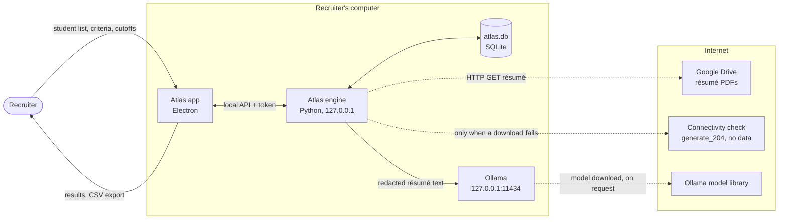
```mermaid
flowchart LR
    recruiter(["Recruiter"])
    subgraph laptop["Recruiter's computer"]
        app["Atlas app<br>Electron"]
        engine["Atlas engine<br>Python, 127.0.0.1"]
        db[("atlas.db<br>SQLite")]
        ollama["Ollama<br>127.0.0.1:11434"]
    end
    subgraph internet["Internet"]
        drive["Google Drive<br>résumé PDFs"]
        check["Connectivity check<br>generate_204, no data"]
        registry["Ollama model library"]
    end
    recruiter -- "student list, criteria, cutoffs" --> app
    app -- "results, CSV export" --> recruiter
    app <-- "local API + token" --> engine
    engine <--> db
    engine -- "redacted résumé text" --> ollama
    engine -. "HTTP GET résumé" .-> drive
    engine -. "only when a download fails" .-> check
    ollama -. "model download, on request" .-> registry
```

### 2. Process model
Three kinds of process. The sandboxed renderer only sees `window.atlas`; Electron main holds the per-launch token and validates every call before passing it to the engine, which runs three worker threads over one SQLite database.

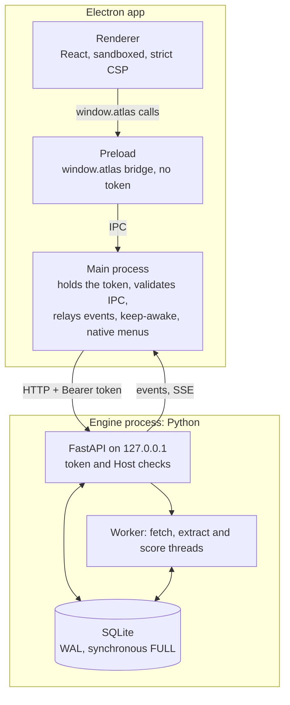
```mermaid
flowchart TB
    subgraph electron["Electron app"]
        renderer["Renderer<br>React, sandboxed, strict CSP"]
        preload["Preload<br>window.atlas bridge, no token"]
        main["Main process<br>holds the token, validates IPC,<br>relays events, keep-awake, native menus"]
    end
    subgraph engineproc["Engine process: Python"]
        api["FastAPI on 127.0.0.1<br>token and Host checks"]
        worker["Worker: fetch, extract and score threads"]
        sqlite[("SQLite<br>WAL, synchronous FULL")]
    end
    renderer -- "window.atlas calls" --> preload
    preload -- "IPC" --> main
    main -- "HTTP + Bearer token" --> api
    api -- "events, SSE" --> main
    api --> worker
    api <--> sqlite
    worker <--> sqlite
```

### 3. The résumé pipeline
Each stage claims work by changing a candidate's state in the database, so a crash at any point leaves every candidate in a known state. At most two résumés are ahead of the model at once, and a downloaded PDF is deleted only after its text has been committed.

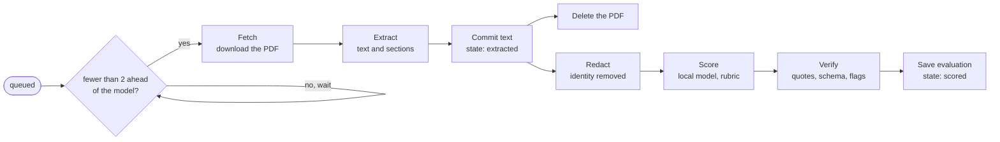
```mermaid
flowchart LR
    queued(["queued"]) --> gate{"fewer than 2 ahead<br>of the model?"}
    gate -- "yes" --> fetch["Fetch<br>download the PDF"]
    gate -- "no, wait" --> gate
    fetch --> extract["Extract<br>text and sections"]
    extract --> commit["Commit text<br>state: extracted"]
    commit --> delete["Delete the PDF"]
    commit --> redact["Redact<br>identity removed"]
    redact --> score["Score<br>local model, rubric"]
    score --> verify["Verify<br>quotes, schema, flags"]
    verify --> save["Save evaluation<br>state: scored"]
```

### 4. Candidate states
Exactly the transitions in `engine/db.py` (`CANDIDATE_TRANSITIONS`), labelled with the `Database` method that makes each one. A system problem puts work back (`return_to_queue`, `return_to_extracted`; crash recovery does the same at start-up); only a problem with the student's own file or link fails them.

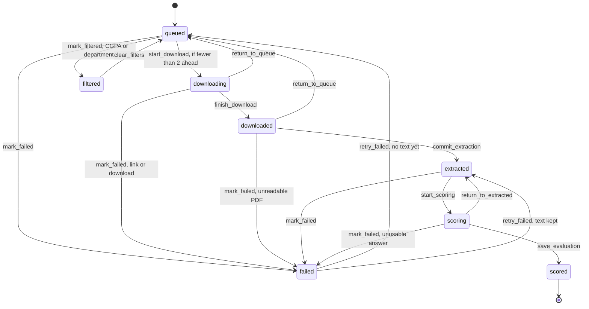
```mermaid
stateDiagram-v2
    [*] --> queued
    queued --> downloading: start_download, if fewer than 2 ahead
    queued --> filtered: mark_filtered, CGPA or department
    queued --> failed: mark_failed
    downloading --> downloaded: finish_download
    downloading --> queued: return_to_queue
    downloading --> failed: mark_failed, link or download
    downloaded --> extracted: commit_extraction
    downloaded --> queued: return_to_queue
    downloaded --> failed: mark_failed, unreadable PDF
    extracted --> scoring: start_scoring
    extracted --> failed: mark_failed
    scoring --> scored: save_evaluation
    scoring --> extracted: return_to_extracted
    scoring --> failed: mark_failed, unusable answer
    failed --> queued: retry_failed, no text yet
    failed --> extracted: retry_failed, text kept
    filtered --> queued: clear_filters
    scored --> [*]
```

### 5. Run states
A run is locked once it starts. Three pause reasons continue by themselves when the problem goes away; the others wait for **Resume**.

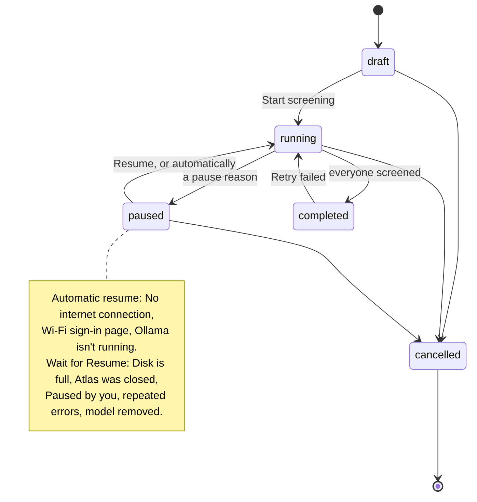
```mermaid
stateDiagram-v2
    [*] --> draft
    draft --> running: Start screening
    draft --> cancelled
    running --> paused: a pause reason
    running --> completed: everyone screened
    running --> cancelled
    paused --> running: Resume, or automatically
    paused --> cancelled
    completed --> running: Retry failed
    cancelled --> [*]
    note right of paused
        Automatic resume: No internet connection,
        Wi-Fi sign-in page, Ollama isn't running.
        Wait for Resume: Disk is full, Atlas was closed,
        Paused by you, repeated errors, model removed.
    end note
```

### 6. Data model (schema version 3)
Buckets are never stored: they're computed from scores, cutoffs and overrides each time Results is shown.

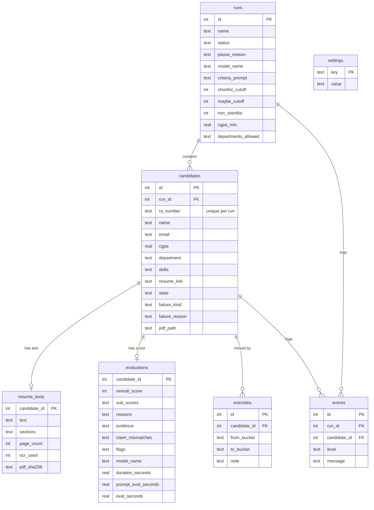
```mermaid
erDiagram
    runs ||--o{ candidates : contains
    runs ||--o{ events : logs
    candidates ||--o| resume_texts : "has text"
    candidates ||--o| evaluations : "has score"
    candidates ||--o{ overrides : "moved by"
    candidates ||--o{ events : logs
    runs {
        int id PK
        text name
        text status
        text pause_reason
        text model_name
        text criteria_prompt
        int shortlist_cutoff
        int maybe_cutoff
        int min_shortlist
        real cgpa_min
        text departments_allowed
    }
    candidates {
        int id PK
        int run_id FK
        text ra_number "unique per run"
        text name
        text email
        real cgpa
        text department
        text skills
        text resume_link
        text state
        text failure_kind
        text failure_reason
        text pdf_path
    }
    resume_texts {
        int candidate_id PK
        text text
        text sections
        int page_count
        int ocr_used
        text pdf_sha256
    }
    evaluations {
        int candidate_id PK
        int overall_score
        text sub_scores
        text reasons
        text evidence
        text claim_mismatches
        text flags
        text model_name
        real duration_seconds
        real prompt_eval_seconds
        real eval_seconds
    }
    overrides {
        int id PK
        int candidate_id FK
        text from_bucket
        text to_bucket
        text note
    }
    events {
        int id PK
        int run_id FK
        int candidate_id FK
        text level
        text message
    }
    settings {
        text key PK
        text value
    }
```

### 7. One screening, from the click to the export
The renderer never talks to the engine directly: every request goes through Electron main, which adds the token. Native dialogs (open, save) run in main, so file paths never reach the renderer.

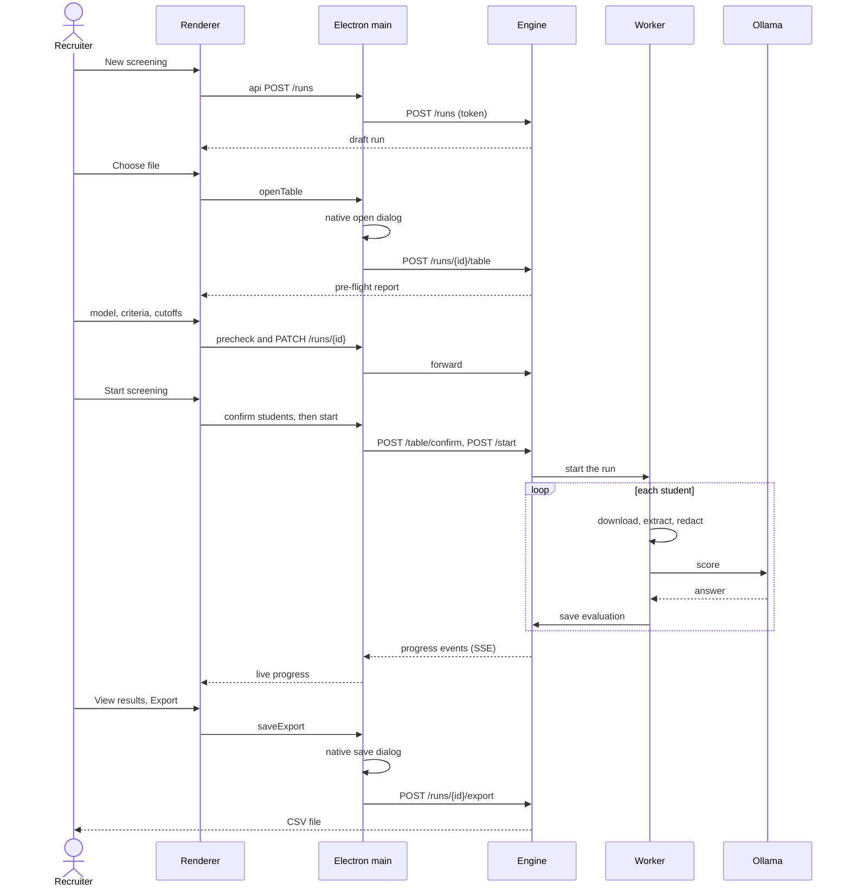
```mermaid
sequenceDiagram
    actor R as Recruiter
    participant UI as Renderer
    participant M as Electron main
    participant E as Engine
    participant W as Worker
    participant O as Ollama
    R->>UI: New screening
    UI->>M: api POST /runs
    M->>E: POST /runs (token)
    E-->>UI: draft run
    R->>UI: Choose file
    UI->>M: openTable
    M->>M: native open dialog
    M->>E: POST /runs/{id}/table
    E-->>UI: pre-flight report
    R->>UI: model, criteria, cutoffs
    UI->>M: precheck and PATCH /runs/{id}
    M->>E: forward
    R->>UI: Start screening
    UI->>M: confirm students, then start
    M->>E: POST /table/confirm, POST /start
    E->>W: start the run
    loop each student
        W->>W: download, extract, redact
        W->>O: score
        O-->>W: answer
        W->>E: save evaluation
    end
    E-->>M: progress events (SSE)
    M-->>UI: live progress
    R->>UI: View results, Export
    UI->>M: saveExport
    M->>M: native save dialog
    M->>E: POST /runs/{id}/export
    E-->>R: CSV file
```

### 8. How a score becomes a bucket
The model scores six parts of the résumé against an anchored rubric; code, not the model, computes the overall score and decides the bucket. Cutoffs never go into the prompt.

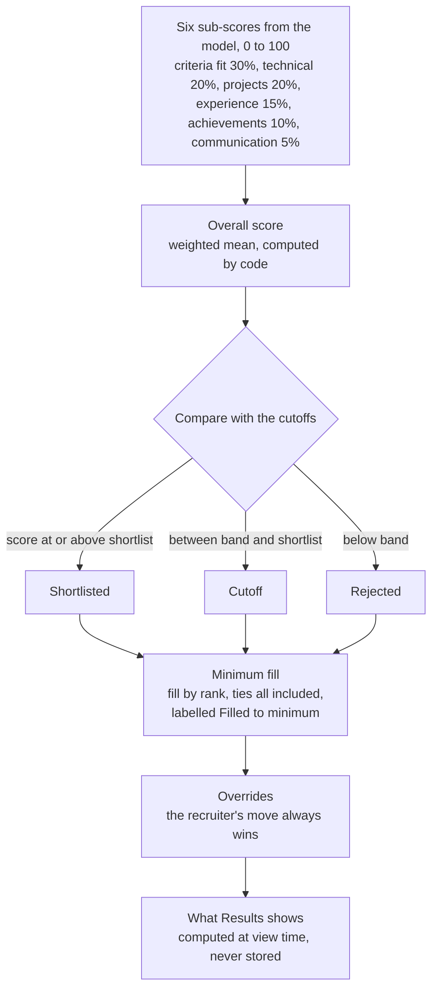
```mermaid
flowchart TB
    subs["Six sub-scores from the model, 0 to 100<br>criteria fit 30%, technical 20%, projects 20%,<br>experience 15%, achievements 10%, communication 5%"]
    overall["Overall score<br>weighted mean, computed by code"]
    rules{"Compare with the cutoffs"}
    short["Shortlisted"]
    band["Cutoff"]
    rejected["Rejected"]
    fill["Minimum fill<br>fill by rank, ties all included,<br>labelled Filled to minimum"]
    override["Overrides<br>the recruiter's move always wins"]
    final["What Results shows<br>computed at view time, never stored"]
    subs --> overall --> rules
    rules -- "score at or above shortlist" --> short
    rules -- "between band and shortlist" --> band
    rules -- "below band" --> rejected
    short --> fill
    band --> fill
    rejected --> fill
    fill --> override --> final
```

## Tech stack
| Layer | Technology | Why |
|---|---|---|
| Engine | Python 3.12, FastAPI + uvicorn, Pydantic 2 | One language for all the logic; typed, validated API and model answers |
| State | SQLite (WAL, `synchronous=FULL`) | One file, crash-safe transactions, nothing to install |
| Résumés | requests, PyMuPDF, openpyxl | Downloading, PDF text, Excel input |
| AI | Ollama + a local model (`qwen3:8b` suggested) | Résumé text never leaves the computer |
| App | Electron 44, React 19, TypeScript, electron-vite | One desktop app for macOS and Windows |
| UI | TanStack Query and Virtual, Motion, Lucide icons, Inter (Windows) | Live data, 2,000-row lists, Apple-like motion |
| Tests | unittest, Vitest, Playwright for Electron | Engine, components and the real app end to end |
| Packaging | PyInstaller, electron-builder | No Python needed on the recruiter's laptop; per-user Windows installer, macOS DMG |
| CI | GitHub Actions | Tests on Windows and macOS, installers as artifacts |

## Repository layout
```text
app/            Electron + React app (main, preload, renderer, shared API types, tests)
engine/         Python engine: database, pipeline, model client, API server, CLI, tests, eval
packaging/      PyInstaller spec, engine build and smoke test, licence check, icons
docs/           Install, troubleshooting, data handling, signing, eval, demo file, step summaries
prompts/        The phase prompts the project was built from
.github/        CI workflow
graphify-out/   GRAPH_REPORT.md: a map of the code (only the report is committed)
```
`local/` (real data, never committed), `legacy/` (the old QWENTUS CLI, reference only), `build/`, `dist/` and `.venv/` are not part of the product.

## Quick start
```powershell
py -3.12 -m venv .venv; .\.venv\Scripts\Activate.ps1
pip install -r engine/requirements-dev.txt -c engine/constraints.txt
cd app; npm ci
ollama pull qwen3:8b
npm run demo:fast      # every screen with fictional students; or: npm run dev
```
Full commands: [START_CMDS.md](START_CMDS.md)

## Privacy and security
- **What stays on the computer:** the student list, résumé text, scores, notes and settings, all in one data folder; downloaded PDFs are deleted as soon as their text is saved.
- **What goes out:** HTTP GETs of the résumé links; when a download fails, a connection check that sends no data; model downloads by Ollama when you ask. No telemetry, accounts or update checks.
- **Identity redaction:** name, email, phone, RA number, section and photos are removed from everything the model sees, including from the résumé's own header, emails and profile handles; a leak check confirms it on real data without printing any.
- **Ollama must be local:** the engine refuses any Ollama address that isn't this computer, so no setting can send résumé text to a remote model.
- **Token and CSP:** the engine listens on `127.0.0.1` only, checks the `Host` header, and requires a per-launch token that only Electron main holds; the renderer is sandboxed with a strict Content-Security-Policy and can't navigate away or open windows.
- **Logs:** `engine.log` rotates and never contains résumé text, names, emails or phone numbers; students appear by RA number.

Details for the firm and its legal team: [docs/DATA_HANDLING.md](docs/DATA_HANDLING.md).

## Testing
| Suite | Count | Command |
|---|---|---|
| Engine (unittest) | 409 (1 skipped: OCR, which the shipped app doesn't include) | `python -m unittest discover -s engine/tests -t .` |
| App unit tests (Vitest) | 188 | `cd app; npm test` |
| End to end (Playwright, the real app against local stubs) | 60, plus 2 that need a packaged build or an install | `cd app; npm run e2e` |

- **Both kill tests** run in every engine suite: `test_kill` kills a database writer 20 times and `test_worker_kill` kills the real worker 20 times; both check the database's integrity and that no work is lost or duplicated.
- **The eval harness** measures scoring quality on a labelled set: `python -m engine.eval run --set engine/eval/sets/fictional --model qwen3:8b` (fictional set: Spearman 0.99, bucket agreement 88%). See [docs/EVAL.md](docs/EVAL.md).
- **CI** (`.github/workflows/ci.yml`) runs everything on Windows and macOS, checks third-party licences, and builds the installers.

## Status and known limitations
**Ready for a supervised pilot** with a small, consented list on one recruiter's laptop. Honestly:
- **Unsigned.** Windows SmartScreen warns, Smart App Control may block the installer outright, and macOS needs *Open Anyway* ([docs/SIGNING.md](docs/SIGNING.md)).
- **macOS hasn't been seen by a person yet;** CI runs the tests there and uploads screenshots.
- **Slow on CPU-only laptops:** about 140 s per real résumé, so 200 students take about 8 hours (run it overnight).
- **No OCR in the shipped app:** scanned résumés go to Needs attention for a person to read.
- **Scoring quality is proven on fictional data only;** the firm's own labelled set is the next step.
- **A licensing decision is pending:** the PDF library (PyMuPDF) is AGPL or commercial ([THIRD_PARTY_NOTICES.md](THIRD_PARTY_NOTICES.md)).
- **The logo is Apple's Swift logo,** supplied for this project. Before any distribution outside this project, replace it: Apple's trademark guidelines don't allow the Swift logo as a product icon ([docs/SIGNING.md](docs/SIGNING.md) says how).

## Documentation
| Document | For |
|---|---|
| [START_CMDS.md](START_CMDS.md) | Every command: setup, development, demo, tests, builds |
| [docs/INSTALL.md](docs/INSTALL.md) | Recruiters: installing Ollama and Atlas, first run, overnight checklist |
| [docs/TROUBLESHOOTING.md](docs/TROUBLESHOOTING.md) | Every message Atlas shows, what it means, what to do (generated from the code) |
| [docs/DATA_HANDLING.md](docs/DATA_HANDLING.md) | What happens to student data, for the firm's legal team |
| [docs/SIGNING.md](docs/SIGNING.md) | Code signing: what to buy, how to add it |
| [docs/EVAL.md](docs/EVAL.md) | Measuring scoring quality with a labelled set |
| [docs/demo/](docs/demo/) | The fictional demo student list |
| [ARCHITECTURE.md](ARCHITECTURE.md) | The design reference |
| [PLAN.md](PLAN.md) | Phases, steps, progress and deferred work |
| [CLAUDE.md](CLAUDE.md) | Rules and conventions for working in this repository |
| [docs/summaries/](docs/summaries/) | Step and phase summaries, CHANGELOG |
| [THIRD_PARTY_NOTICES.md](THIRD_PARTY_NOTICES.md) | Third-party components and their licences |

## License
Proprietary. Copyright © 2026 Aryan Gupta. All rights reserved. See [LICENSE](LICENSE).

Atlas includes third-party components under their own licences; see [THIRD_PARTY_NOTICES.md](THIRD_PARTY_NOTICES.md).

The Swift logo and the "hello" lettering (the app's logo, icon and start-up screen) are trademarks of Apple Inc. and are not covered by the licence ([THIRD_PARTY_NOTICES.md](THIRD_PARTY_NOTICES.md) → *Brand assets*).
